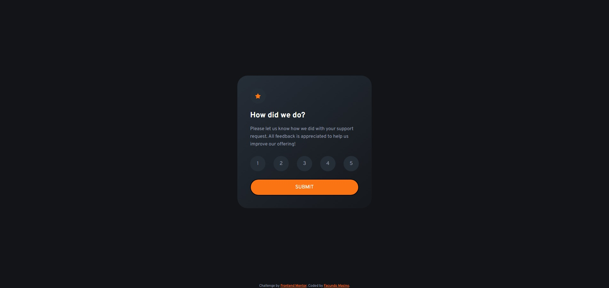
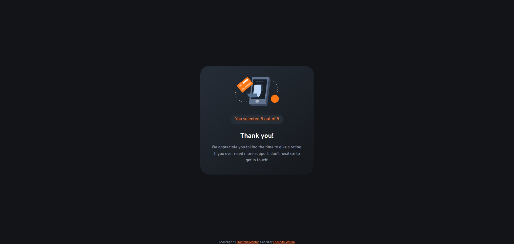

# Frontend Mentor - Interactive rating component solution

This is a solution to the [Interactive rating component challenge on Frontend Mentor](https://www.frontendmentor.io/challenges/interactive-rating-component-koxpeBUmI). Frontend Mentor challenges help you improve your coding skills by building realistic projects. 

## Table of contents

- [Frontend Mentor - Interactive rating component solution](#frontend-mentor---interactive-rating-component-solution)
  - [Table of contents](#table-of-contents)
  - [Overview](#overview)
    - [The challenge](#the-challenge)
    - [Screenshot](#screenshot)
    - [Links](#links)
  - [My process](#my-process)
    - [Built with](#built-with)
  - [Author](#author)

## Overview

### The challenge

Users should be able to:

- View the optimal layout for the app depending on their device's screen size
- See hover states for all interactive elements on the page
- Select and submit a number rating
- See the "Thank you" card state after submitting a rating

### Screenshot

### Links

- Solution URL: [GitHub](https://github.com/FacuMasino/interactive-rating-component)
- Live Site URL: [GitHub Page](https://your-live-site-url.com)

## My process

As mentioned in the style-guide I first started with the HTML structure of the solution, then the CSS/SASS coding. For the SASS code I used a very simple structure which consists in 4 files: base, components, layouts and main.

- base: contains resets, variables, mixins and utility classes.
- components: resuable classes.
- layout: the CSS that handles the layout, the main structure.
- main: contain the imports for all the files.

Also I used normalize.css for handling all the resets and avoid typical problems with browsers compatibility.

### Built with

- Semantic HTML5 markup
- SASS
- Flexbox
- Normalize.css
- JavaScript

## Author

- Frontend Mentor - [@FacuMasino](https://www.frontendmentor.io/profile/FacuMasino)
- LinkedIn - [@facundomasino](https://www.linkedin.com/in/facundomasino/)
